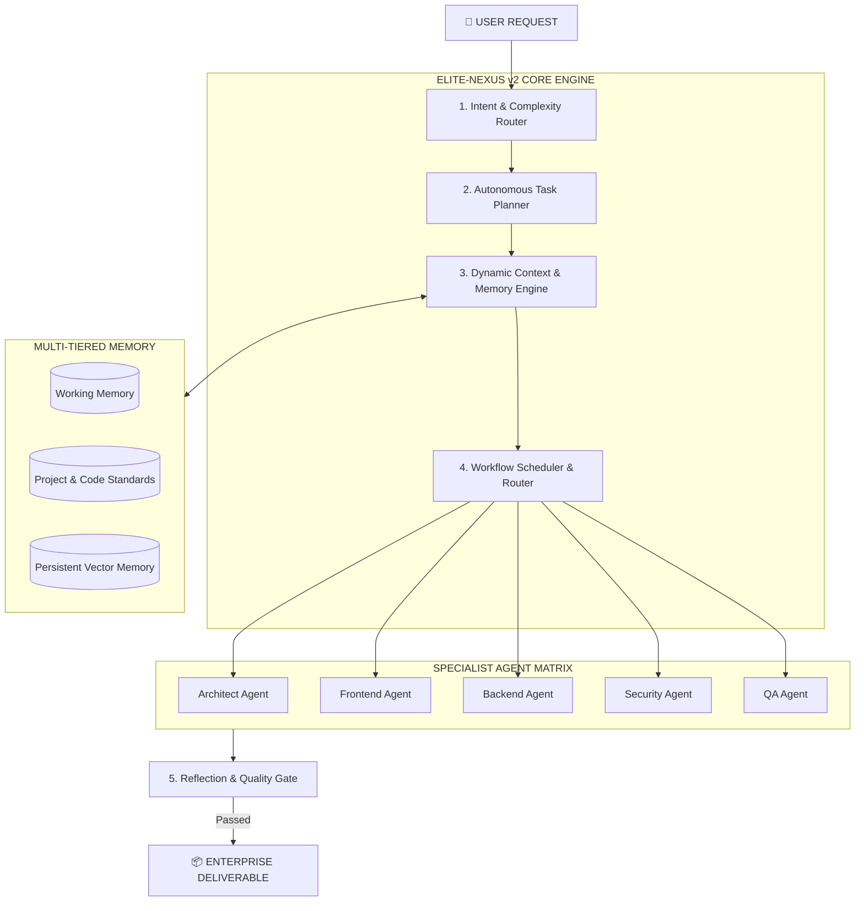

<div align="center">

# ⚡ RYKER MULTI-AGENT TECH ⚡
### *ELITE-NEXUS v2 Master Autonomous AI Operating System*

[](https://github.com/rykerzz-tech/ryker-multi-agent-tech/releases)
[](LICENSE)
[](https://github.com/rykerzz-tech)
[](package.json)
[](https://github.com/rykerzz-tech/ryker-multi-agent-tech)

<br>

```bash
npx ryker-multi-agent-tech init
```

</div>

---

## 🌟 Architecture Overview

**Ryker Multi-Agent Tech v1.0.0 (ELITE-NEXUS v2)** is an enterprise-grade autonomous AI operating system designed for multi-agent orchestration, intelligent LLM provider failover, multi-tiered memory management, and universal IDE integration.

Built around the **ELITE-NEXUS v2 11-Step Cognitive Pipeline**, Ryker automatically routes prompts to specialized domain agents, builds dynamic DAG execution plans, enforces security guardrails, and validates all code outputs via automated reflection and quality gates.

---

## 📂 Consolidated Clean Workspace Structure

```
ryker-multi-agent-tech/
├── 📁 .nexus/                     # ELITE-NEXUS v2 Operating System Config & Memory
├── 📁 bin/                        # Global CLI Binaries & Server Launchers
├── 📁 lib/                        # Enterprise Core Runtime, Guardrails & LLM Providers
├── 📁 dashboard/                  # Real-Time Web Dashboard (Next.js 14 + Tailwind)
├── 📁 docs/                       # Architecture Blueprints & API Documentation
├── 📁 scripts/                    # Automation Utilities & Code Validators
├── 📄 package.json                # Project Dependencies & Scripts
├── 📄 Dockerfile                  # Containerization Configuration
└── 📄 README.md                   # Enterprise System Documentation
```

---

## 🏛️ Master Architecture Diagram



---

## 🚀 Quick Start & CLI Reference

```bash
# Initialize interactive setup
npx ryker-multi-agent-tech init

# Start interactive multi-agent chat session
ryker-multi-agent-tech chat

# Execute task with full ELITE-NEXUS v2 pipeline
ryker-multi-agent-tech run "Build production auth service"

# Run complete unit & integration test suite (138 tests)
npm test
```

---

## 📊 Key Platform Capabilities

- **🧠 11-Step Cognitive Pipeline**: Autonomous intent routing, complexity estimation, task decomposition, self-critique, and reflection.
- **⚡ Multi-LLM Failover Engine**: Seamless fallback across OpenAI GPT-4o, Anthropic Claude 3.5, Groq, Ollama (Local), and Mock testing providers.
- **🛡️ Enterprise Guardrails**: Path traversal protection, sandbox execution limits, rate limiting, and safe file write validation.
- **🖥️ Real-time Web Dashboard**: Next.js dashboard with live WebSocket trace updates, memory monitoring, and automated report exports.
- **🔌 MCP Protocol Support**: Full native Model Context Protocol (MCP) server integration.

---

## 📄 License & Maintainer

Distributed under the **Apache-2.0 License**. Maintained with devotion by **[rykerzz-tech](https://github.com/rykerzz-tech)**.
