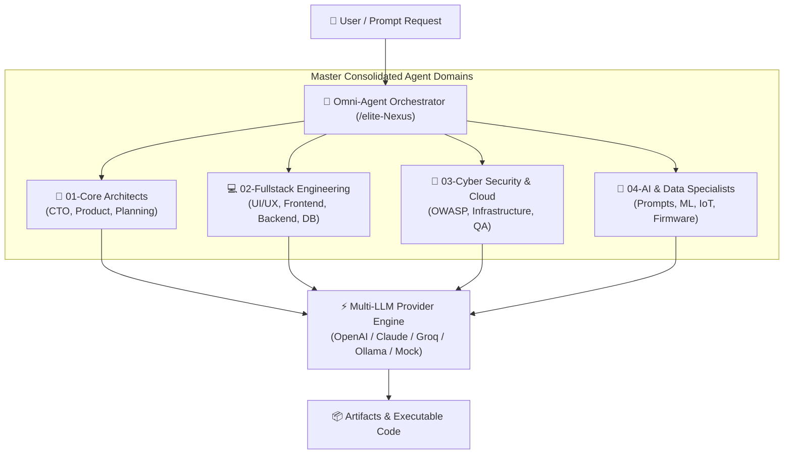

<div align="center">

# ⚡ RYKER MULTI-AGENT TECH ⚡

### *Next-Generation Autonomous AI Agent Operating System & Framework*

[](https://github.com/rykerzz-tech/ryker-multi-agent-tech/releases)
[](LICENSE)
[](https://github.com/rykerzz-tech)
[](package.json)

<br>

```bash
npx ryker-multi-agent init
```

<br>

</div>

---

## 🌟 Overview

**Ryker Multi-Agent Tech v1.0.0** is an enterprise-grade, lightweight AI Agent Platform engineered for multi-agent orchestration, intelligent LLM provider failover, and multi-IDE native integration (Cursor, Windsurf, Roo Code).

Designed with a modular **Omni-Agent Routing Engine (`/elite-Nexus`)**, Ryker empowers developers to deploy 84+ specialist agents across 4 master engineering domains to build, audit, test, and ship complex software solutions automatically.

---

## 🚀 Quick Start (Instant Setup)

Initialize Ryker Multi-Agent Tech directly inside any project workspace with a single command:

```bash
# Initialize interactive setup
npx ryker-multi-agent init

# Or using full package name
npx ryker-multi-agent-tech init
```

### ⚡ Global CLI Installation

```bash
# Install globally
npm install -g ryker-multi-agent-tech

# Run interactive agent generator
ryker-multi-agent-tech init

# Start interactive multi-agent chat session
ryker-multi-agent-tech chat
```

---

## 🏗️ Master Omni-Agent Architecture



---

## 🔥 Key Features

- **🧠 Omni-Agent Routing Engine**: Automatically recruits and orchestrates specialized domain agents based on prompt intent without manual switching.
- **⚡ Multi-LLM Failover Pipeline**: Automatic fallback across OpenAI GPT-4o, Anthropic Claude 3.5, Groq, Ollama (Local), and Mock testing providers.
- **🛡️ Built-in Guardrails System**: Path traversal blocking, rate limiting, command execution sandbox, and safe file write validation.
- **🔌 Model Context Protocol (MCP) Server**: Full native integration with MCP tools, inspectors, and dynamic tool definitions.
- **📱 Universal IDE Support**: Zero-config auto-discovery for **Cursor IDE** (`.cursor/`), **Windsurf IDE** (`.windsurf/`), and **Roo Code** (`.roo/`).

---

## 💻 CLI Commands Quick Reference

| Command | Description |
|:---|:---|
| `ryker-multi-agent-tech init` | Run interactive Smart Init wizard |
| `ryker-multi-agent-tech chat` | Launch interactive multi-agent terminal session |
| `ryker-multi-agent-tech run "<prompt>"` | Execute agent with natural language prompt |
| `ryker-multi-agent-tech add skill <name>` | Install domain skill into workspace |
| `ryker-multi-agent-tech remove skill <name>` | Remove domain skill |
| `ryker-multi-agent-tech test` | Run agent test suites (`*.test.md`) |
| `ryker-multi-agent-tech inspect` | Inspect workspace agent health and configuration |

---

## 📁 Repository Structure

```text
ryker-multi-agent-tech/
├── bin/                          # CLI & Server Entry points
│   ├── cli.js                    # Global CLI executable
│   └── server.js                 # API Server executable
├── lib/                          # Core Runtime Engine
│   ├── api/                      # REST & WebSocket Server APIs
│   ├── commands/                 # CLI Command Implementations
│   ├── core/                     # Agent Loader, Guardrails, Failover
│   └── mcp/                      # Model Context Protocol Server & Tools
├── ryker-multi-agent-tech-dashboard/ # Modern Next.js Management Web Dashboard
├── templates/                    # Agent & Workflow Templates
├── CHANGELOG.md                  # Release Version History
├── CODEBASE.md                   # System & Module Documentation
├── LICENSE                       # Apache License 2.0
└── package.json                  # Package Configuration
```

---

## 📄 License & Attribution

Distributed under the **Apache License 2.0**. See [`LICENSE`](LICENSE) for details.

<br>

<div align="center">

**[Apache License 2.0](LICENSE)** © 2026 Ryker MultiAgent Tech — Created & Maintained by **[rykerzz-tech](https://github.com/rykerzz-tech)**

<p>
  <a href="https://github.com/rykerzz-tech"><b>@rykerzz-tech</b></a>
</p>

<p>
  <a href="https://github.com/rykerzz-tech/ryker-multi-agent-tech/stargazers">⭐ Star us on GitHub</a> ·
  <a href="https://github.com/rykerzz-tech/ryker-multi-agent-tech/issues">🐛 Report Issues</a> ·
  <a href="https://www.npmjs.com/package/ryker-multi-agent-tech">📦 npm Package</a>
</p>

</div>
