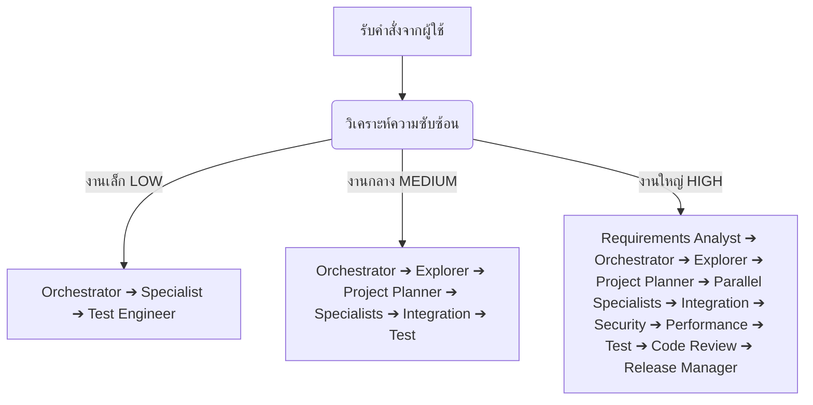

# สถาปัตยกรรม Elite-Nexus Multi-Agent OS (v3.0.0)

เอกสารฉบับนี้อธิบายโครงสร้างระบบ สถาปัตยกรรมการจัดสรรงาน และกระบวนการทำงานของ **Elite-Nexus Multi-Agent OS** หลังจากปรับปรุงโครงสร้างเพื่อเพิ่มความเสถียรและจำกัดบทบาทเอเจนต์ให้มีหน้าที่ชัดเจน (Specialist Boundaries)

---

## 1. การจัดประเภทบทบาทของเอเจนต์ (Core Specialist Agents)
ระบบมี Specialist Agent ทั้งหมด **29 ตัว** แบ่งออกเป็น 5 กลุ่มทักษะหลัก เพื่อหลีกเลี่ยงความซ้ำซ้อนและลดความเสี่ยง:

### 1.1 Core Orchestration (กลุ่มจัดการและวางแผนระบบ)
*   **Orchestrator (`orchestrator`)**: เป็นตัวประสานงานหลัก วิเคราะห์ความซับซ้อน คัดเลือกเอเจนต์ที่เชี่ยวชาญเฉพาะทาง และควบคุมทิศทาง workflow
*   **Explorer Agent (`explorer-agent`)**: วิเคราะห์โครงสร้างโปรเจกต์ ค้นหาไฟล์ และประเมินเทคโนโลยีที่ใช้ใน workspace
*   **Project Planner (`project-planner`)**: ออกแบบแผนงานการแก้ปัญหาหรือพัฒนาฟีเจอร์ในแบบลำดับขั้นก่อนเริ่มลงมือทำงาน
*   **Requirements Analyst (`requirements-analyst`)**: วิเคราะห์รายละเอียดความต้องการของเป้าหมาย ดึงเงื่อนไขสำคัญ และกำหนดเกณฑ์การวัดผลที่จับต้องได้

### 1.2 Software Engineering (กลุ่มวิศวกรรมซอฟต์แวร์)
*   **Frontend Specialist (`frontend-specialist`)**: พัฒนาโครงสร้างหน้าตาผู้ใช้ (UI/UX), เขียน CSS, HTML, React, Next.js
*   **Backend Specialist (`backend-specialist`)**: พัฒนาระบบตรรกะฝั่งเซิร์ฟเวอร์, API, NodeJS, Node script, Python
*   **Mobile Specialist (`mobile-specialist`)**: พัฒนาแอปพลิเคชันสำหรับอุปกรณ์พกพา เช่น React Native, Flutter, Expo
*   **Integration Specialist (`integration-specialist`)**: ตรวจสอบการเชื่อมต่อโมดูลต่าง ๆ และรวบรวมไฟล์ปลายทางให้ทำงานสอดประสานกัน
*   **API Specialist (`api-specialist`)**: ออกแบบข้อตกลงและทดสอบความถูกต้องของ API endpoint ตามมาตรฐาน (REST/GraphQL)

### 1.3 Product & Experience (กลุ่มผลิตภัณฑ์และประสบการณ์ใช้งาน)
*   **UI/UX Specialist (`uiux-specialist`)**: ออกแบบการจัดวางข้อมูลและลำดับภาพให้เหมาะสมกับผู้ใช้งาน
*   **Accessibility Specialist (`accessibility-specialist`)**: ตรวจสอบความถูกต้องตามมาตรฐาน WCAG, ARIA เพื่อการใช้งานของทุกคน
*   **SEO Specialist (`seo-specialist`)**: ปรับแต่ง Metadata, sitemaps, robots.txt และประเมินคะแนน SEO
*   **Content Specialist (`content-specialist`)**: ปรับปรุงเนื้อหา ข้อความตรรกะในระบบ ตลอดจนระบบแสดงภาษาหลายภาษา

### 1.4 Data & AI (กลุ่มจัดการข้อมูลและปัญญาประดิษฐ์)
*   **Database Specialist (`database-specialist`)**: ออกแบบตารางข้อมูล ดึงข้อมูล และทำ Migration โครงสร้างฐานข้อมูล (Prisma, SQL)
*   **Data Engineer (`data-engineer`)**: จัดการท่อส่งข้อมูล (Data Pipelines), ตรวจสอบความถูกต้องของข้อมูลขนาดใหญ่
*   **AI/ML Specialist (`ai-ml-specialist`)**: พัฒนาและวิเคราะห์การตอบกลับหรือการวิเคราะห์ด้วยโมเดล Machine Learning
*   **Prompt Engineer (`prompt-engineer`)**: ปรับปรุงคำสั่ง (System Prompt) และการจัดโครงสร้างคำสั่งโมเดล LLM ให้เหมาะสม

### 1.5 Infrastructure & Operations (กลุ่มโครงสร้างพื้นฐาน)
*   **DevOps Specialist (`devops-specialist`)**: จัดการ Container (Docker), ท่อส่งการพัฒนาอัตโนมัติ (CI/CD Pipeline)
*   **Cloud Architect (`cloud-architect`)**: ออกแบบและตรวจสอบโครงสร้างบนระบบคลาวด์ เช่น AWS, Vercel
*   **SRE Specialist (`sre-specialist`)**: ปรับปรุงความน่าเชื่อถือ ตรวจจับข้อผิดพลาด และจัดการระบบบันทึก Log และ Alert
*   **Network Specialist (`network-specialist`)**: ออกแบบเครือข่าย จัดการ DNS, ใบรับรองความปลอดภัย SSL/TLS

### 1.6 Quality & Security (กลุ่มคุณภาพและความปลอดภัย)
*   **Test Engineer (`test-engineer`)**: ออกแบบและรัน Unit Test/Integration Test เพื่อประเมินความสมบูรณ์ของระบบ
*   **Security Specialist (`security-specialist`)**: ค้นหาช่องโหว่ ตรวจสอบระบบยืนยันตัวตน และจัดการความเสี่ยงด้านความปลอดภัย
*   **Debugger (`debugger`)**: แก้ไขปัญหา ข้อผิดพลาด (Bugs) ในโค้ด และตรวจสอบสาเหตุด้วย Stack Trace
*   **Performance Specialist (`performance-specialist`)**: วิเคราะห์และแก้ไขปัญหาคอขวด เช่น Caching, ความเสถียร, การย่อขนาด bundle
*   **Code Reviewer (`code-reviewer`)**: ตรวจสอบแนวทางการเขียนโค้ดตามมาตรฐาน DRY, SOLID และสถาปัตยกรรมที่ถูกต้อง

### 1.7 Delivery & Knowledge (กลุ่มการจัดส่งความรู้)
*   **Documentation Specialist (`documentation-specialist`)**: จัดทำเอกสารคู่มือ คำอธิบายระบบในรูปแบบ Markdown หรือ HTML
*   **Release Manager (`release-manager`)**: ประเมินความพร้อม ตรวจสอบเช็คลิสต์การ Deploy ก่อนส่งผลงานออกสู่ระดับโปรดักชัน
*   **Migration Specialist (`migration-specialist`)**: ย้ายระบบเดิมเข้าสู่ระบบใหม่ และอัปเกรดเวอร์ชันของโมดูลระบบต่าง ๆ

---

## 2. ลำดับกระบวนการทำงานแบบไดนามิก (Dynamic Workflows)

Orchestrator จะวิเคราะห์ระดับความซับซ้อน (Complexity Level) เพื่อกำหนดเส้นทางการทำงานให้สอดคล้องกับขนาดของงาน:



### 2.1 งานเล็ก (LOW Complexity)
*   **ตัวอย่าง**: การแต่งโค้ด CSS สั้น ๆ หรือแก้ไขข้อผิดพลาดเล็กน้อยในฟังก์ชันเดี่ยว
*   **สตรีมย่อย**: `Orchestrator` ➔ `Specialist` (เช่น frontend-specialist) ➔ `Test Engineer`

### 2.2 งานกลาง (MEDIUM Complexity)
*   **ตัวอย่าง**: การเพิ่มฟีเจอร์ใหม่ที่ไม่ส่งผลกระทบต่อแกนกลาง เช่น สร้างระบบ Authentication หรือเพิ่ม API ใหม่
*   **สตรีมย่อย**: `Orchestrator` ➔ `Explorer` ➔ `Project Planner` ➔ `Specialists` (เช่น backend/frontend) ➔ `Integration Specialist` ➔ `Test Engineer`

### 2.3 งานใหญ่ (HIGH Complexity)
*   **ตัวอย่าง**: การย้ายฐานข้อมูลขององค์กร การอัปเดตสถาปัตยกรรมระดับแกนกลาง หรือสร้างระบบใหม่ทั้งหมด
*   **สตรีมย่อย**: `Requirements Analyst` ➔ `Orchestrator` ➔ `Explorer` ➔ `Project Planner` ➔ `Parallel Specialists` (เช่น database/backend/security) ➔ `Integration Specialist` ➔ `Security Specialist` ➔ `Performance Specialist` ➔ `Test Engineer` ➔ `Code Reviewer` ➔ `Release Manager`

---

## 3. การแสดงผลข้อมูลในแต่ละระดับความซับซ้อน (Structured Thai Reporting)

เมื่อการรันเสร็จสิ้นลง ระบบจะจำกัดการแสดง Execution Trace ตามความเหมาะสม เว้นแต่จะระบุคำสั่ง `--trace` หรือ `--verbose`:

### งานเล็ก (LOW)
```text
━━━━━━━━━━━━━━━━━━━━━━
✅ เสร็จสิ้น

ดำเนินการ: แก้ไขฟังก์ชันดึงข้อมูลผู้ใช้สำเร็จ
ตรวจสอบ: Build: PASS | Tests: PASS
สถานะ: PASS
━━━━━━━━━━━━━━━━━━━━━━
```

### งานกลาง (MEDIUM)
```text
━━━━━━━━━━━━━━━━━━━━━━
✅ เสร็จสิ้น

ทำอะไร: พัฒนาระบบ API สำหรับจัดการบทความ
แก้ไข: Backend, Database
ตรวจสอบ: Build: PASS | Tests: PASS
สถานะ: PASS
━━━━━━━━━━━━━━━━━━━━━━
```

### งานใหญ่ (HIGH)
```text
━━━━━━━━━━━━━━━━━━━━━━
✅ เสร็จสิ้น

งาน: อัปเกรดระบบจัดเก็บข้อมูลและเปลี่ยนสถาปัตยกรรมหลัก
ส่วนที่แก้ไข: Backend, Database, Cloud
การตรวจสอบ: Build: PASS | Tests: PASS | Security: PASS
ปัญหา: ไม่มี
สถานะ: PASS
━━━━━━━━━━━━━━━━━━━━━━
```

---

## 4. วิธีการใช้ CLI
การสลับโหมดในการรันเพื่อเปิดดู Execution Trace:

1.  **โหมดปกติ (สั้น ชัดเจน อ่านง่าย)**:
    ```bash
    ryker-multi-agent-tech run "เพิ่มปุ่มล็อกอินที่หน้าแรก"
    ```
2.  **โหมดดีบั๊กเต็มรูปแบบ (Full Trace)**:
    ```bash
    ryker-multi-agent-tech run "เพิ่มปุ่มล็อกอินที่หน้าแรก" --trace
    # หรือ
    ryker-multi-agent-tech run "เพิ่มปุ่มล็อกอินที่หน้าแรก" --verbose
    ```
